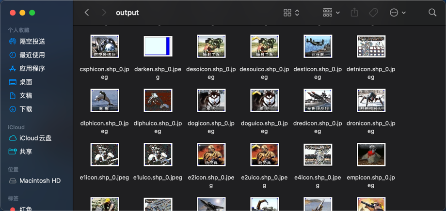

# ra2 mix
> go 语言开发的 ra2 资源文件解析器
## 文件类型
mix：资源包文件，类似文件目录解析见 [mix.go](mix.go) 只支持原版的解码，MO3的有额外加密 
pal：调色盘文件，解析见 [pal.go](pal.go) 
shp：动画序列帧文件，解析见 [shp.go](shp.go) 
vxl：体素模型，解析见 [vxl.go](vxl.go) 
hva：vxl 的动画文件，解析见 [hva.go](hva.go) 
aud：音效文件，解析见 [aud.go](aud.go) 
pcx：图片资源文件，解析见 [pcx.go](pcx.go) 
dat：mix 目录下对应的文件清单，解析见 [dat.go](dat.go) 不过我们是直接使用 [mix_database.json](res/mix_database.json) 已经解析好的映射文件 
ini，txt，pkt：纯文本配置文件 
fnt：点阵字体文件，一般推荐使用自己的字体文件，暂未支持 
vpl：vxl 材质属性，暂未支持 
sha：存储阴影数据，暂未支持 
mrf：过场动画资源，暂未支持 
tem，urb，sno，des，ubn，lun：温带地形文件，城市地形文件，雪地地形文件，沙漠地形文件，新城区地形文件，月球地形文件 
## 解析效果

## 项目参考
https://www.zhihu.com/column/c_1899172031100069701 
https://github.com/OpenRA/OpenRA 
https://github.com/OlafvdSpek/xcc 
## 调色板选择
地形调色板：xxxsno.pal，xxxtem.pal，xxxurb.pal 不同类型对应环境下的调色板
单位调色板：unittem.pal、uniturb.pal 不同地形下单位对应的调色板
> 上面只是一般规律，可能不准确